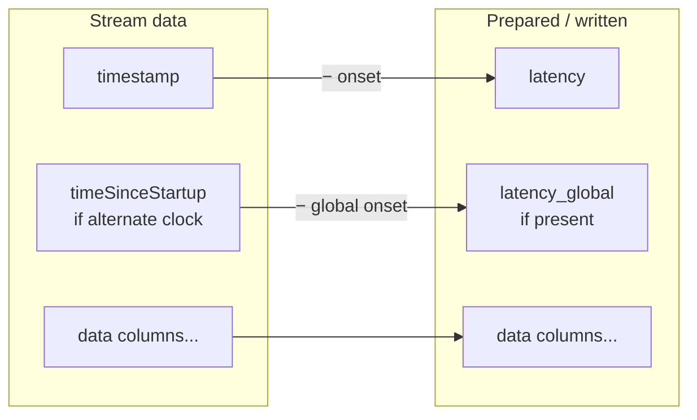

# Pipeline Stages

This page explains how a session moves through the pipeline, what data structure carries it, and what each of the six stages does. For the configuration knobs referenced here, see the [Configuration Reference](configuration.md).

## Orchestration

The entry point `run(config_path)` does the following:

1. Loads and validates the [config](configuration.md).
2. Builds a `BIDSLayout` rooted at `output.bids_root`.
3. Determines the sessions to process — from `session_mappings`, or by auto-discovery if none are given.
4. Processes each session through all six stages (below).
5. After all sessions, writes the **dataset-level files** (`dataset_description.json`, `participants.tsv`/`.json`, `README`, `.bidsignore`, and the derivative dataset description).

Each session is processed independently. If a session raises a pipeline error it is **logged and skipped**, and processing continues with the next — one bad recording doesn't abort the batch.

### The Session object

Everything about one recording is carried by a `Session`. As the stages run, they populate it:

| Attribute | Set by | Holds |
| --------- | ------ | ----- |
| `metadata` | Load | Parsed `SessionMetadata` (timing, feature flags, software versions). |
| `raw_continuous_data`, `raw_face_data`, `raw_events_data` | Load | The source DataFrames. |
| `custom_tables`, `custom_tables_data` | Load | Custom-table schema and per-table DataFrames. |
| `streams` | Split | `dict[TrackingSystem, TrackingStream]` — the per-system data. |
| `merged_events_data` | Validate | Events merged with custom tables. |
| `subject_id`, `session_label` | Load | BIDS identifiers from the session mapping. |

Each `TrackingStream` holds the system's `data` (raw) and `clean_data` (post-masking), its `quality_flags`, expected/effective sampling frequencies, channel count, and computed stats. Useful derived properties include `duration_seconds`, `row_count`, `warning_count`/`error_count`, and `get_output_data()` (returns `clean_data` if present, else `data`).

---

## 1. Load

`load_session(session_dir, input_config)` reads the session folder:

- Locates each file by glob pattern (most-recent wins on multiple matches).
- Parses `SessionMetadata.json` (required) and the continuous CSV (required); renames the global clock `timeSinceStartup` → `timestamp`.
- Loads the optional face, events, and custom-table files; a bad face file is downgraded to a warning.

The result is a `Session` populated with raw data and metadata. See [Input Data Format](input-data.md) for the file details.

---

## 2. Split

`split_continuous_data(...)` slices the single wide continuous DataFrame into one `TrackingStream` per enabled system, assigning columns by [prefix](input-data.md#how-columns-map-to-tracking-systems). A system is skipped if it's disabled in `systems`, disabled by the recording's metadata flags, or has no data columns. **Face** is built from the dedicated face file rather than the continuous data.

This stage is **split-only** — it selects columns and sets up the time axis, nothing more:

- If no [alternate time column](configuration.md#preprocessing) is configured for a system, its `timestamp` stays as the global clock.
- If one is configured, the alternate column becomes `timestamp` and the global clock is preserved as `timeSinceStartup`.

Each system **must** have an entry in [`sampling_frequencies`](configuration.md#sampling_frequencies) or this stage raises a `ConfigurationError`. The stream's *effective* rate is measured from the data at this point.

!!! note "No time transforms here"
    LATENCY channels are **not** computed during splitting. That conversion happens at export time, in [`prepare_motion_data`](#latency-channels).

---

## 3. Validate

For each stream, the registry runs every enabled check and attaches the resulting `QualityFlag`s to `stream.quality_flags`. Checks may be per-stream or multi-stream (declaring `required_streams`). A check that throws is caught, recorded as a *failed check*, and skipped — it never aborts the run. Failed checks between sessions are cleared so batch runs stay independent.

After validation, the session's events and custom tables are merged into `merged_events_data`.

Full details and the catalog of built-in checks: [Validation & Quality Checks](validation.md).

---

## 4. Preprocess

`preprocess_stream(stream, apply_masking, masking_checks)` produces each stream's `clean_data`:

- With `apply_quality_masking: false` (the default), `clean_data` is simply a copy of the raw data.
- With masking **on**, every flag marked maskable (optionally filtered to `masking_checks`) is applied: the flagged time ranges are set to `NaN` — either across the whole row or only the flag's `target_columns`. **All rows are preserved**; time columns are never masked. Integer/boolean columns are widened to nullable dtypes so they can hold `NaN`.

Masking only affects the **derivative** tier. The raw tier is written from the unmodified `data`.

---

## 5. Export BIDS

A session is written **twice** — once as RAW (from `stream.data`) and once as DERIVATIVE under `derivatives/resxr/` (from `stream.get_output_data()`). The pipeline also copies the original session folder verbatim into `sourcedata/`.

For each stream, just before writing, the data goes through `prepare_motion_data` (below). The resulting prepared DataFrame drives all three outputs for that system — `motion.tsv`, `channels.tsv`, and `motion.json` — so they always describe identical columns.

Also written: per-session `scans.tsv` (one row per motion file, with the recording's UTC acquisition time) and, on the raw tier, the merged `events.tsv`. See [BIDS Output](bids-output.md) for the complete file catalog.

### LATENCY channels

The recorder's internal time columns are never exported as-is. `prepare_motion_data(df)` converts them into BIDS **LATENCY** channels:

- **`latency`** — `timestamp` minus the recording onset (the first non-zero timestamp). Inserted as the first column. Rows before onset / after the last valid sample are set to `NaN`.
- **`latency_global`** — present **only when** a per-system time column was used (so `timeSinceStartup` exists separately). It is `timeSinceStartup` minus the global onset, inserted right after `latency`.

Both are reported in **seconds**. The original `timestamp` and `timeSinceStartup` columns are dropped from the output. This is what gives every BIDS file a single, onset-relative time axis starting at 0.

---

## 6. Report

If `report.enabled` is true, an interactive HTML report is generated per session at `<session_dir>/<session_id>_report.html`. It summarizes the session, per-stream statistics, and a Plotly timeline of all quality flags — with flag times converted to a single onset-relative global timeline.

See [Quality Reports](reports.md).

---

## Raw vs. derivative tiers

| | RAW (`<bids_root>/`) | DERIVATIVE (`<bids_root>/derivatives/resxr/`) |
| --- | --- | --- |
| Source data | `stream.data` (unmodified) | `stream.get_output_data()` (masked if enabled) |
| Quality masking | never | applied when `apply_quality_masking: true` |
| `dataset_description.json` | `DatasetType: raw` | `DatasetType: derivative`, `GeneratedBy: ResXR` |
| Events files | yes (merged `events.tsv`) | no |
| LATENCY conversion | yes | yes |

The two tiers always contain the same set of tracking systems and the same column layout; they differ only in whether flagged samples have been masked.
