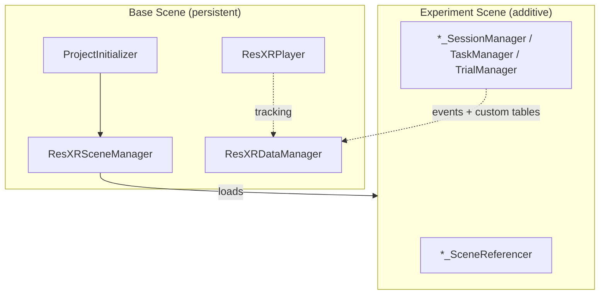
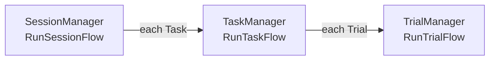
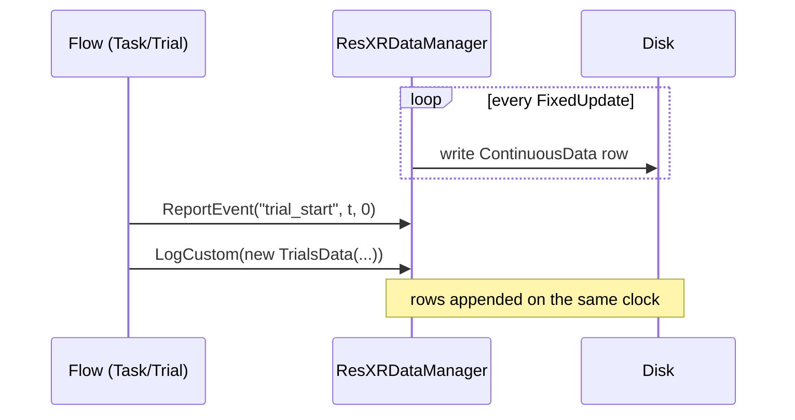

# Architecture

The template separates three concerns: a **persistent Base Scene** that runs for the whole session, **experiment scenes** loaded on top of it, and a **flow** that sequences the experiment. Understanding how these fit together is the key to building your own study.

## The Base Scene

The Base Scene holds the components that must survive across experiment scenes. Experiment scenes are loaded *additively* (added to the running Base Scene rather than replacing it), so these components keep tracking and recording without interruption.



| Component | Role |
| --------- | ---- |
| `ProjectInitializer` | Entry point. On `Start` it optionally runs room calibration, then hands control to the scene manager. Fields `_shouldProjectUseCalibration` and `_shouldCalibrateOnEditor` decide whether calibration runs at all and whether it also runs in the editor. |
| `ResXRSceneManager` | Loads and switches experiment scenes additively, with fade-to-black transitions. `BaseSceneIndex` (default `0`) and `FirstSceneToLoadIndex` (default `1`) select what loads at startup; `SwitchActiveScene(name)` changes scenes at runtime. It also repositions the player when a scene provides a `PlayerRepositioner`. |
| `ResXRPlayer` | The tracking rig facade. Exposes the head and hand transforms, the `ResXREyeTracker`, face expressions, and helpers like `FadeViewToColor(...)`, `RepositionPlayer(...)`, and `SetPassthrough(...)`. |
| `ResXRDataManager` | The recorder. Builds the CSV schemas, runs the [collectors](recording.md#subsystems-and-their-toggles) every tick, and writes all output files. |

!!! info "Singletons"
    The managers derive from `ResXRSingleton<T>`, a base class that exposes a single global instance (`ResXRPlayer.Instance`, `ResXRDataManager.Instance`, …) and an overridable `DoInAwake()` hook. This is why experiment code can reach the player or recorder from anywhere without wiring up references.

## The flow: Session → Task → Trial

An experiment is structured as a three-level hierarchy. Each level has a manager that runs the level below it:



- **`SessionManager`** holds a `Task[]` and runs each task in turn (`RunSessionFlow`). `StartSession()` / `EndSession()` bracket the session; `EndSession()` calls `Application.Quit()` so the recorder finalizes its files.
- **`TaskManager`** holds a `Trial[]` and runs each trial (`RunTaskFlow`), with `StartTask()` / `EndTask()` and a `BetweenTrialsFlow()` hook.
- **`TrialManager`** runs a single trial (`RunTrialFlow`), with `StartTrial()` / `EndTrial()`.

The control flow is asynchronous: each `Run…Flow` method is a `UniTask` (UniTask is a Unity-friendly form of `async`/`await`), so a step can simply `await` a participant action — a touch, a button press, a timer — pausing until it happens without freezing the rest of the app.

!!! note "`Task` was formerly `Round`"
    The middle level is now **Task**; the `SessionManager` field carries a `[FormerlySerializedAs("_rounds")]` attribute so older scenes still deserialize. If you find references to a "round manager" in older material, that is this level.

### Scaffold vs. worked examples

The generic Flow Management classes under `Assets/ResXR/Flow Management/` are an intentionally minimal **scaffold**: `Task` and `Trial` are empty containers, and the `Start…`/`End…` methods are empty hooks. They define the shape of an experiment without prescribing its content. Extend `Task`/`Trial` with the fields your study needs:

```csharp
[System.Serializable]
public class MyTrial : Trial
{
    public GameObject stimulus;
    public float durationSeconds;
}
```

!!! warning "The bare scaffold does not run unmodified"
    `SessionManager.BetweenTasksFlow()` throws `NotImplementedException`, so running the unedited `SessionManager` with more than one `Task` stops with an exception between tasks. Fill in (or remove) that hook before relying on it.

The three [paradigms](paradigms.md) are the **worked implementations** of this pattern. Each ships its own `*_SessionManager`, `*_TaskManager`, `*_TrialManager`, and `*_SceneReferencer` with real logic, instruction panels, interactions, and data logging. These are *independent classes that follow the same pattern* — they do **not** inherit from the generic `SessionManager`/`TaskManager`/`Task`/`Trial`. When building a new experiment, copy the paradigm closest to yours (its whole set of flow files) and edit it, rather than trying to subclass the bare scaffold.

## Where recording fits

Recording is decoupled from the flow. `ResXRDataManager` samples tracking continuously regardless of which task or trial is active, so the continuous and face files are one unbroken timeline for the whole session. The flow's job is to *annotate* that timeline: your `Start…`/`End…` hooks call `ReportEvent(...)` to drop event markers and `LogCustom(...)` to append per-trial rows, all on the same `timeSinceStartup` clock.



The recorder is set up in `DoInAwake()` (schemas built, files opened) and finalized in `OnDestroy()` (last rows flushed, custom-tables sidecar written). That finalization is why a clean `Application.Quit()` matters; see [Data Output](data-output.md). For the public methods involved, see [Scripting & API](scripting.md).
