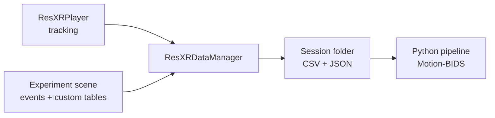

# Unity Template

`resxr-unity-research-template` is a Unity 6 project template for building XR behavioral experiments that run standalone on Meta Quest headsets (Quest 2, Quest 3, Quest Pro). It records head, hand, eye, face, and body tracking together with experiment events, and writes them to per-session CSV and JSON files. Those files are the **input** to the [Python pipeline](../python/index.md), which converts them to a [Motion-BIDS](https://bids.neuroimaging.io/) dataset.

The two components share no code. Their only contract is the set of files the template writes; see [Data Output](data-output.md).

!!! tip "New here? Start with the basics"
    Read [Installation](installation.md) then [Quickstart](quickstart.md) to open the project, run one of the built-in experiments in the editor, and find the files it produces. The remaining pages are reference material.

## The recording model

!!! info "Unity terms used in these docs"
    A **scene** is a saved arrangement of objects (the experiment world); a **GameObject** is one object in a scene; a **component** is a script or behavior attached to a GameObject. A **prefab** is a reusable, pre-configured GameObject you can drop into any scene. A **MonoBehaviour** is the base class for a Unity script component. **Additive loading** means a scene is loaded *on top of* another instead of replacing it. A **collider** is an invisible shape Unity uses to detect contact — for example, a hand touching an object. You set a component's fields in the **Inspector**, the panel on the right of the Unity editor.

A persistent **Base Scene** holds two components that run for the whole session: `ResXRPlayer` (tracking) and `ResXRDataManager` (recording). Experiment scenes are loaded additively (on top of the Base Scene, not replacing it) and unloaded when they finish, while these two components keep running.

`ResXRDataManager` samples a fixed set of **collectors** once per physics tick (Unity's `FixedUpdate`, 100 Hz by default) and writes one row per tick to `*_ContinuousData.csv`. In parallel, your experiment code logs **events** (a stimulus appeared, a choice was made) and **custom tables** (per-trial summaries, ratings) at whatever moments matter, on the same clock. Everything lands in one timestamped session folder on the headset.

## The three built-in paradigms

The template ships three complete, runnable experiments under `Assets/ResXR/Demo Experiments/`. Each is a worked example of the flow model, interaction, and data logging you can copy from. See [Paradigms](paradigms.md) for details.

- **Binary Choice** — two images are shown; the participant reaches out and touches one. Logs the choice and reaction time.
- **Maze Navigation** — the participant walks a physical-scale maze to reach a coin; the maze rotates between trials.
- **Museum Viewing** — the participant freely explores a gallery and rates artworks on a slider, with gaze tracked on each piece.

## What to read next

| Page | Covers |
| ---- | ------ |
| [Installation](installation.md) | Unity version, packages, importing the template, headset setup. |
| [Quickstart](quickstart.md) | Open the Base Scene, run a paradigm, locate the output files. |
| [Paradigms](paradigms.md) | The three demo experiments and how to configure them. |
| [Recording](recording.md) | What is recorded, how to enable subsystems, reference frames, sampling. |
| [Data Output](data-output.md) | The files written, their naming, and the data contract with the pipeline. |
| [Architecture](architecture.md) | Base Scene, the Session → Task → Trial flow, and the data manager. |
| [Scripting & API](scripting.md) | Key components and the APIs for logging events and custom tables. |
| [Extending the Template](extending.md) | Custom collectors, multi-experiment projects, performance notes. |
